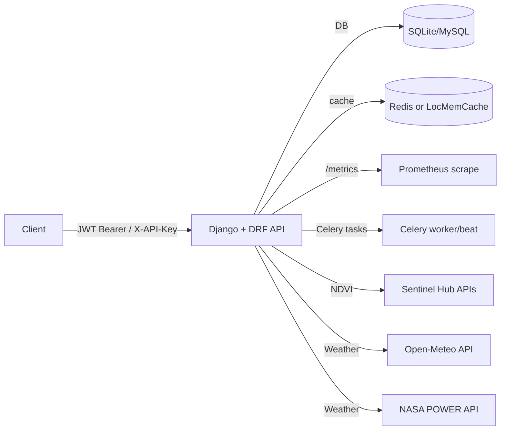

# Weather APIs

Django + DRF service that provides authenticated APIs for user accounts, API key
lifecycle management, farm resources, NDVI (Sentinel Hub) retrieval, and
provider-backed weather data (Open-Meteo + NASA POWER).

This repo uses both JWT (for user sessions and API key management) and
first-party API keys (`X-API-Key`) for service-to-service calls.

## Features

- Auth: register/login, token refresh, profile, password change (`/api/v1/auth/`)
- API keys: create/list/revoke/rotate (JWT-only) (`/api/v1/keys/`)
- Farms: CRUD for user-owned farms (`/api/v1/farms/`)
- NDVI: timeseries/latest, raster retrieval and queueing, job status (`/api/v1/…/ndvi/`)
- Weather: current/daily/weekly with provider selection (`/api/v1/weather/…`)
- Caching: Redis (recommended/required in production) or local-memory cache
- Background jobs: Celery tasks for NDVI refresh/backfill and raster rendering
- Observability: Prometheus metrics via `django-prometheus` at `/metrics`

## Architecture



## Quickstart (local dev)

### Requirements

- Python: see `pyproject.toml` (project requires Python `>=3.11`)
- Recommended: a local Redis instance for cache and Celery broker/backends

### Setup

```bash
python -m venv .venv
source .venv/bin/activate
pip install -r requirements.txt
pip install -r requirements-dev.txt
```

### Environment

This project loads environment variables from `.env` (see `config/settings.py`).
An example file exists at `.env.example`.

Minimum variables for local development:

```dotenv
DJANGO_SECRET_KEY=change-me
DJANGO_DEBUG=True
DJANGO_ALLOWED_HOSTS=127.0.0.1,localhost
```

Additional commonly-used variables (all optional unless noted):

```dotenv
# Deployment mode: development|ci|staging|production
DJANGO_ENV=development

# Database (defaults to local sqlite file if unset)
DATABASE_URL=sqlite:///db.sqlite3

# Cache (required when DJANGO_ENV=production; see config/settings.py)
REDIS_URL=redis://localhost:6379/0

# API keys (required for staging/production; otherwise defaults to "dev-pepper")
DJANGO_API_KEY_PEPPER=long-random-string

# JWT lifetime settings
SIMPLE_JWT_ACCESS_MINUTES=15
SIMPLE_JWT_REFRESH_DAYS=7

# Throttling
API_KEY_THROTTLE_RATE=500/min

# Weather provider config
WEATHER_PROVIDER_DEFAULT=open_meteo
WEATHER_DEFAULT_TZ=Africa/Nairobi
OPEN_METEO_BASE_URL=https://api.open-meteo.com/v1/forecast
NASA_POWER_BASE_URL=https://power.larc.nasa.gov/api/temporal/daily/point
WEATHER_CACHE_TTL_CURRENT_S=120
WEATHER_CACHE_TTL_DAILY_S=900
WEATHER_CACHE_TTL_WEEKLY_S=1800
WEATHER_MAX_RANGE_DAYS=366

# NDVI config and limits (see config/settings.py for defaults)
NDVI_ENGINE=sentinelhub
NDVI_MAX_AREA_KM2=5000
NDVI_MAX_DATERANGE_DAYS=370

# Sentinel Hub credentials (required when using the Sentinel Hub engine)
SENTINELHUB_CLIENT_ID=...
SENTINELHUB_CLIENT_SECRET=...
SENTINELHUB_BASE_URL=https://services.sentinel-hub.com
```

Note: `.env.example` contains placeholders for additional providers. This repo’s
implemented weather providers are configured via `OPEN_METEO_BASE_URL`,
`NASA_POWER_BASE_URL`, and `WEATHER_*` settings (from code: `config/settings.py`).

### Run

```bash
python manage.py migrate
python manage.py runserver
```

Default timezone behavior:
- `TIME_ZONE` defaults to `Africa/Nairobi` with `USE_TZ=True` (UTC stored in DB).
- Celery uses `CELERY_TIMEZONE=Africa/Nairobi` with `CELERY_ENABLE_UTC=True`
  (from code: `config/settings.py`).

## Quickstart (Docker / docker-compose)

This repo includes a monitoring stack compose file: `docker-compose.monitoring.yml`.
It does not (currently) include a compose definition for the Django app itself.

### Monitoring stack

```bash
docker compose -f docker-compose.monitoring.yml up -d
```

Prometheus and Grafana will be available at:
- Prometheus: `http://localhost:9090`
- Grafana: `http://localhost:3000`

Prometheus is configured to scrape `host.docker.internal:8000/metrics`
(from code: `prometheus.yml`).

### Celery (local processes)

Celery configuration lives in `config/celery.py` and reads settings keys
prefixed with `CELERY_` (from code: `config/celery.py`).

Example commands:

```bash
celery -A config worker -l info
celery -A config beat -l info
```

If you run workers in a separate process, set a real broker URL (e.g., via
`REDIS_URL` or `CELERY_BROKER_URL`); the default `memory://` broker is
process-local (from code: `config/settings.py`).

## API docs

- OpenAPI schema: `/api/schema/`
- Swagger UI: `/api/docs/`
- ReDoc: `/api/redoc/`

Response conventions (from code: `config/api/responses.py`):
- Many APIViews return a success envelope via `success_response`.
- Some ViewSets (e.g., farms) return standard DRF serializer JSON (from code:
  `farms/views.py`).

## Authentication

Global DRF auth includes:

- JWT: `Authorization: Bearer <access>`
- API key: `X-API-Key: <plaintext>`

Not all endpoints accept both:
- `/api/v1/keys/` is JWT-only by design (from code: `api_keys/views.py`).

## Observability

- Metrics endpoint: `/metrics` (from code: `config/urls.py` includes
  `django_prometheus.urls` at the root).
- Prometheus scrape config: `prometheus.yml`
- Example monitoring stack: `docker-compose.monitoring.yml`

## Monitoring

Runbook: [docs/monitoring.md](docs/monitoring.md).

- Grafana dashboard: `monitoring/grafana/dashboards/weather-apis-observability.json`
- Prometheus + Grafana + Loki stack: `docker-compose.monitoring.yml`

## Testing & quality gates

Repo tooling is configured in `pyproject.toml` and `.pre-commit-config.yaml`.

```bash
pre-commit run --all-files
pytest
ruff format .
ruff check .
mypy .
bandit -c pyproject.toml -r .
```

## Security notes

- Secrets and credentials must come from environment variables; do not commit
  secrets into the repo.
- API keys are stored hashed (peppered with `DJANGO_API_KEY_PEPPER`) and only
  returned once at creation/rotation time (from code: `api_keys/auth.py`,
  `api_keys/serializers.py`).
- Throttling is enabled via DRF throttle classes and rates in
  `config/settings.py`.

## Repo structure

- `accounts/`: user authentication and profile endpoints ([README](accounts/README.md))
- `api_keys/`: API key model + authentication + JWT-only lifecycle endpoints ([README](api_keys/README.md))
- `farms/`: user-owned farm resources ([README](farms/README.md))
- `ndvi/`: NDVI retrieval (Sentinel Hub) + Celery tasks + raster support ([README](ndvi/README.md))
- `weather/`: provider-swappable weather subsystem (Open-Meteo + NASA POWER) ([README](weather/README.md))
- `config/`: Django settings/urls/celery wiring
